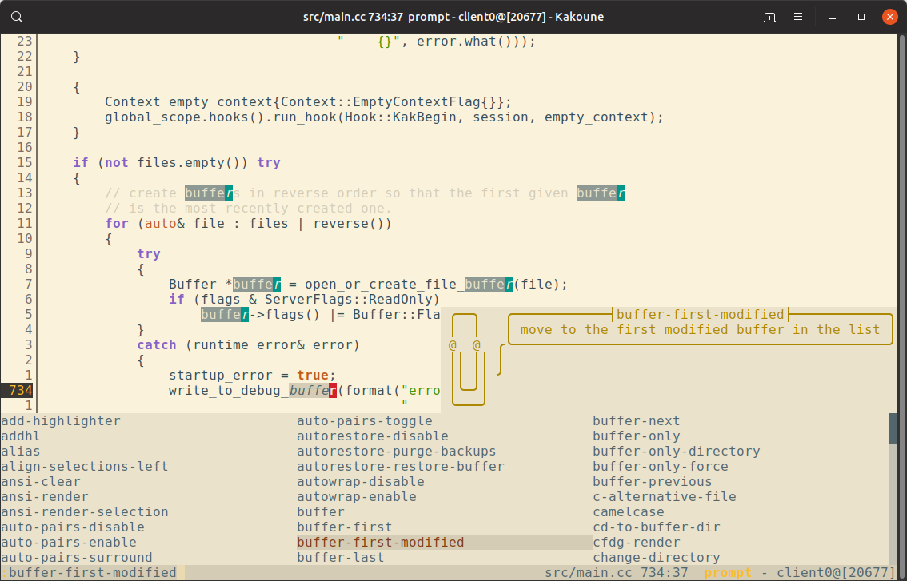
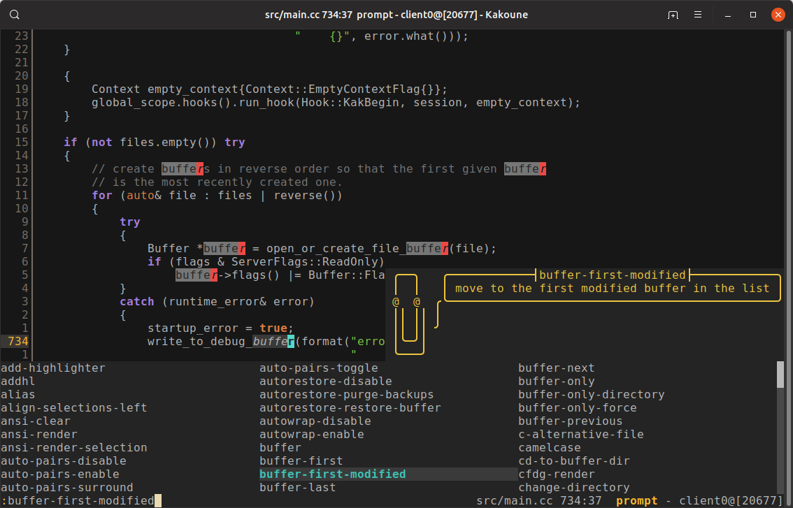
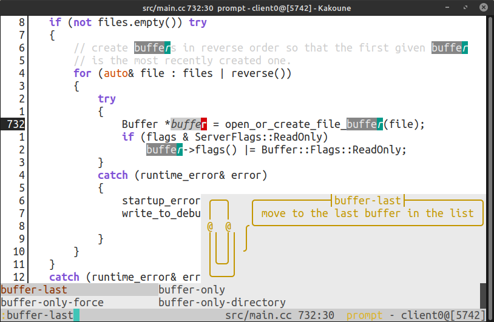
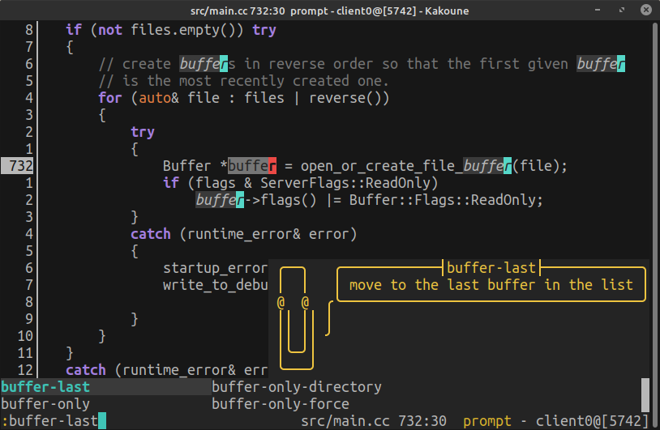

# Kakoune Selenized [](https://github.com/TeddyDD/kakoune-selenized/releases)

Port of [Selenized] color theme for [Kakoune] text editor.

Ported variants:

- [x] Selenized light
- [x] Selenized dark
- [x] Selenized black
- [x] Selenized white

## Screenshot






## Installation

Only last stable release of Kakoune is supported (see changelog).

### [Plug.kak]

```kak
plug "TeddyDD/kakoune-selenized" domain "GitHub.com" theme
```

### Manual

Copy themes you like to `~/.config/kak/colors/` and load with `:colorscheme`
command.

## Changelog

- 0.1 2019-05-05:
    - **Kakoune v2019.01.20**
- 0.2 2019-06-30:
    - _CHANGE_ make primary selection brighter in black variant
- 0.3 2019-11-05:
    - **Kakoune v2019.07.01**
    - _CHANGE_ set colors for following faces: Whitespace, LineNumbers,
      LineNumberCursor, StatusLineInfo
- 1.0 2019-11-07:
    - _ADD_ white and dark variants

[Selenized]: https://github.com/jan-warchol/selenized
[Kakoune]: http://kakoune.org/
[Plug.kak]: https://github.com/andreyorst/plug.kak
